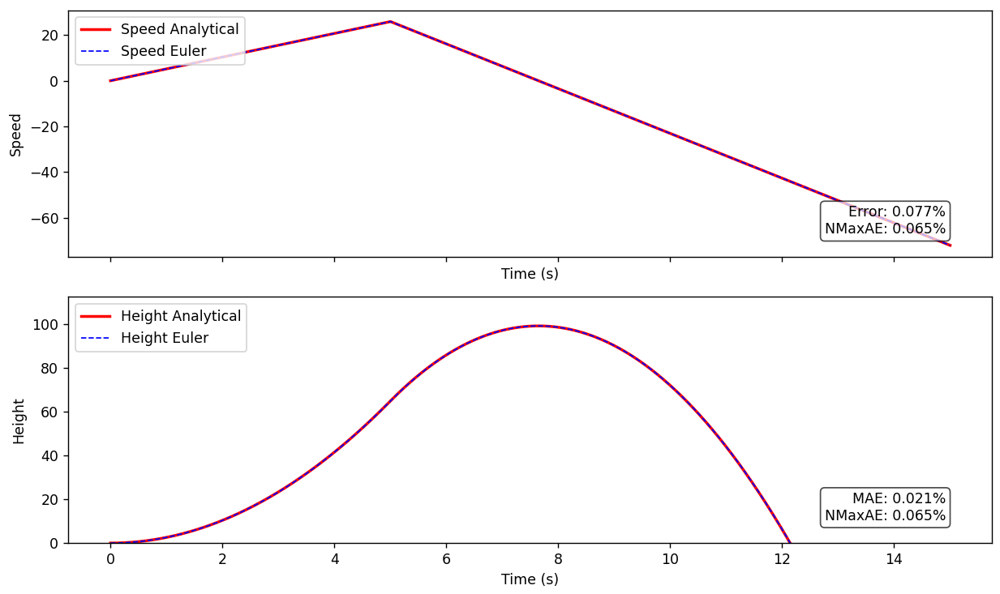

# Rocket flying vertically at constant thrust

> [!Info] Running Example
> A rocket is launched from $h$=0 (m) and $v$=0 (m/s). **No wind**, no dampening effect whatsoever. 
Only gravitational force applied on the center of mass of the rocket.

The equation of motion is:

$$m\ddot{h} = T - mg$$
with:

* $T$ - Thrust of the rocket: 
$T = \begin{cases} 15 \text{ N} & 0 \leq t < 5 
\\ 0 \text{ N} & t \geq 5 \end{cases}$
* $m$ - Mass of the rocket, equal to $1 \text{ kg}$
* g - The gravitational acceleration, equal to $9.81 \text{ m.s}^{-2}$

## The Forward Euler equations
Simple equations for coding insight:
* For **height**:
$$h(t + \Delta t) = h(t) + \Delta t \cdot v(t)$$

* For **speed**:
$$v(t + \Delta t) = v(t) + \Delta t \cdot \frac{T(t) - mg}{m}$$

## The Analytical equations
### At burn phase ($T = 15 \text{ N}$)
$$\ddot{h} = \frac{T - mg}{m} = \frac{15 - 9.81}{1} = 5.19\,\text{m/s}^2$$
Then, through integration and applying initial conditions ($h(0) = 0 \text{ m}$ and $v(0) = 0 \text{ m.s}^{-1}$)
$$v(t) = 5.19\, t$$
$$h(t) = \frac{1}{2} \cdot 5.19 \cdot t^2$$
It's a constant speed situation. Parabolic height. Quite basic.

### After burn phase (coast phase) ($T = 0 \text{ N}$)
> [!Warning] About the time
> You might want to continue using $t$ but it would not take into account the fact that we've translated in time by 5 seconds. Our initial conditions are now set 5 seconds forward in time.
> To take this into account, we **redefine the origin of our time axis** with a **time shift**:
$$t' = t - 5$$
No need to drag the absolute time through the equations that way.

For **speed**:
The initial condition at time $t = 5$ seconds. At that time, we have:
$$v(5) = 5.19 \cdot 5 = 25.95$$
So we can inject and form the **coasting equation** for speed:
$$v(t') = 25.95 - g \cdot t'$$

For **height**:
Same principle:
$$h(5) =\frac{1}{2} \cdot 5.19 \cdot 5^2 = 64.875$$
Then we inject and formulate the coasting equation for height:
$$h(t') = 64.875 + 25.95 \cdot t' - \frac{1}{2} g \cdot t'^2$$

## Comparing Analytical and Forward Euler plots
We created both plots for speed and height using the analytical equations and the FE equations:

The mean  relative error compared to Analytical is shown on the plot.
This is below 1% error of tolerance for our fictive simulation project.

## A better approach for the error
The Euler line could diverge as time passes but have a small **mean relative error** at the end. We don't know how bad the worst point is.

This can be computed with **Normalized Max Absolute Error**:
$$\varepsilon_h = \frac{\max_t \left| h_{\text{euler}}(t) - h_{\text{true}}(t) \right|}{\max_t \left| h_{\text{true}}(t) \right|}$$

This tells us the **worst-case error** as a fraction of the true signal.