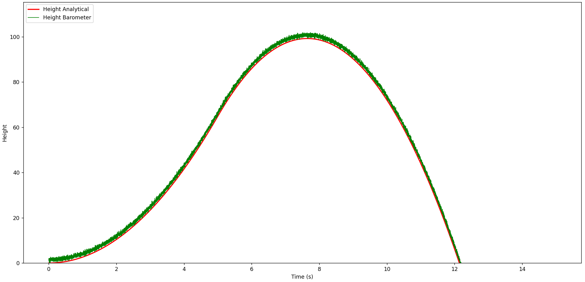
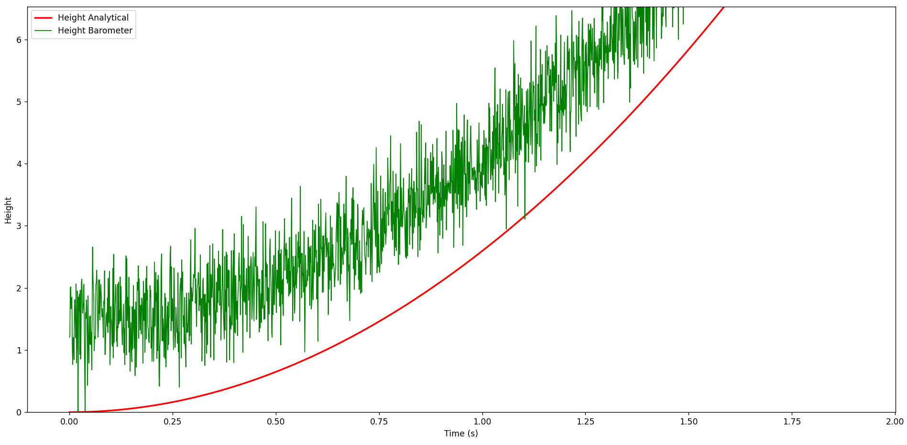

# Simple Noisy Barometer model

The barometer introduces a constant bias of $b=1.5$ meters and has a Gaussian noise of zero mean and standard deviation $\sigma = 0.5$ meters.

$$h_{baro​}(t)=h_{true​}(t)+b+\mathcal{N}(0,\sigma^2)$$

## Results
Comapring the baro to the analytical solution of the rocket's height.

### Overview

### Close up

We identify the clear bias in the close up view.