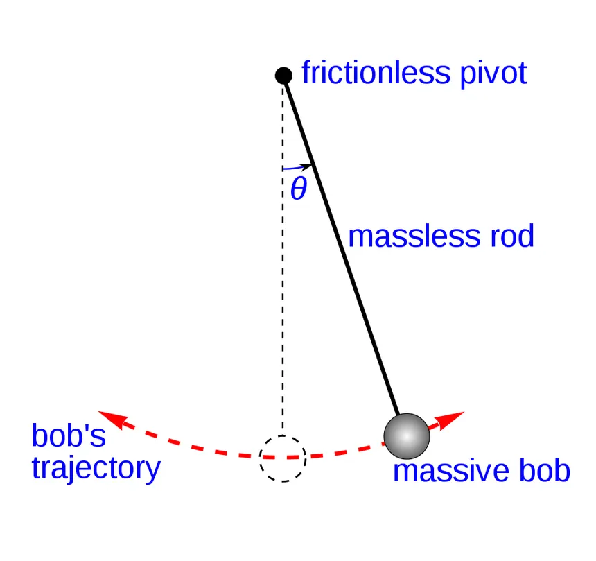
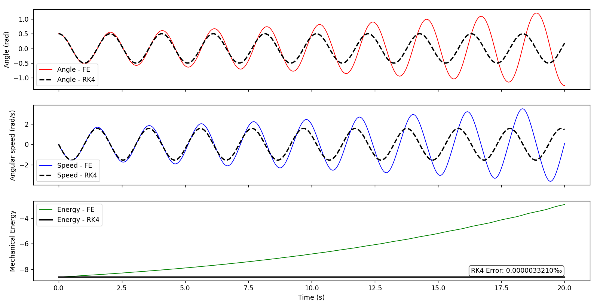

# Pendulum motion integration

> [!Info] Running Example
> A frictionless pendulum of length $l = 1\,\text{m}$ and mass $m = 1\,\text{kg}$ is released from rest at $\theta_0 = 0.5\,\text{rad}$ from vertical. **No friction**, no air resistance. Only gravity acts on the mass.

## Setup

A rod of length $l = 1\,\text{m}$ is pinned at the origin. A point mass $m$ hangs at its end and swings freely in a vertical plane.

    

Two forces act on the mass: tension $\mathbf{T}$ along the rod (radial direction) and gravity $m\mathbf{g}$ (downward). The tension is always perpendicular to the motion, so it does no work. Only the **tangential component of gravity** drives the swing.

## Equation of motion

Working in a Galilean frame fixed to the pivot, applying Newton's second law in the tangential direction (arc length $s = l\theta$, so tangential acceleration is $l\ddot{\theta}$):

$$ml\ddot{\theta} = -mg\sin\theta$$

Dividing through by $ml$:

$$\boxed{\ddot{\theta} + \frac{g}{l}\sin\theta = 0}$$

This is derived from Newton's second law only, no approximation yet.

### Deriving from energy conservation

An equivalent route: total mechanical energy (mass-specific, dividing by $m$) is:

$$E = E_p + E_k = -gl\cos\theta + \frac{1}{2}l^2\dot{\theta}^2$$

> [!Info] Sign of Ep
> The reference height is the pivot point. The mass sits at height $h = -l\cos\theta$ below the pivot. So $E_p = gh = -gl\cos\theta$. At $\theta = 0$ (hanging straight down), $E_p$ is at its minimum $-gl$. At $\theta = 90°$, $E_p = 0$. This tracks physically.

Since the system is frictionless, $\frac{dE}{dt} = 0$. Using the multivariable chain rule ($E$ depends on both $\theta$ and $\dot{\theta}$, both functions of $t$):

$$\frac{dE}{dt} = \frac{\partial E}{\partial \theta}\dot{\theta} + \frac{\partial E}{\partial \dot{\theta}}\ddot{\theta} = gl\sin\theta \cdot \dot{\theta} + l^2\dot{\theta} \cdot \ddot{\theta} = 0$$

Factoring out $l\dot{\theta}$ (valid everywhere except at the isolated turning points where $\dot{\theta} = 0$, where both terms vanish simultaneously):

$$\ddot{\theta} + \frac{g}{l}\sin\theta = 0$$

Same result. Energy conservation and Newton's second law are equivalent routes.

## Why there is no analytical solution

The equation $\ddot{\theta} + \frac{g}{l}\sin\theta = 0$ is **nonlinear** because of the $\sin\theta$ term. No closed-form expression $\theta(t)$ exists in general. This forces us to use numerical integration.
It also means we cannot check our integrator against a true analytical solution. We use **energy conservation** as our ground truth instead: in a frictionless pendulum, $E(t)$ must be constant.

## Numerical methods

We rewrite the second-order ODE as a first-order system by introducing the state vector $y = [\theta,\, \dot{\theta}]^\top$:

$$\dot{y} = f(y) = \begin{bmatrix} \dot{\theta} \\ -\dfrac{g}{l}\sin\theta \end{bmatrix}$$

This is an **autonomous** system: $f$ depends only on the current state $y$, not explicitly on time.

### Forward Euler

At each timestep, use the slope at the current state to step forward:

$$y_{n+1} = y_n + \Delta t \cdot f(y_n)$$

Expanded for each component:

$$\dot{\theta}_{n+1} = \dot{\theta}_n + \Delta t \cdot \left(-\frac{g}{l}\sin\theta_n\right)$$

$$\theta_{n+1} = \theta_n + \Delta t \cdot \dot{\theta}_n$$

### RK4

Forward Euler uses the slope at the start of the step only. RK4 samples the slope at four points within the step and takes a weighted average:

$$k_1 = f(y_n)$$

$$k_2 = f\!\left(y_n + \frac{\Delta t}{2}k_1\right)$$

$$k_3 = f\!\left(y_n + \frac{\Delta t}{2}k_2\right)$$

$$k_4 = f\!\left(y_n + \Delta t\, k_3\right)$$

$$y_{n+1} = y_n + \frac{\Delta t}{6}(k_1 + 2k_2 + 2k_3 + k_4)$$

$k_1$ is the Euler slope at the start. $k_2$ and $k_3$ are two successive estimates of the midpoint slope, each refining the previous. $k_4$ is the slope at the end of the step estimated using $k_3$. The midpoint slopes $k_2$ and $k_3$ receive double weight because the midpoint slope is a better representative of the average slope over the interval than either endpoint.

> [!Warning] Why Euler fails here but not on the rocket
> The rocket's acceleration $\ddot{h} = T/m - g$ does not depend on $h$. The slope is fully determined by time alone. Euler's single-point approximation is exact on any piece of that trajectory.
>
> The pendulum's acceleration $\ddot{\theta} = -(g/l)\sin\theta$ depends on the current position. As the mass moves, the slope changes. Euler commits to the slope at the start of the step and misses that change. The error compounds every cycle: Euler systematically injects a small amount of energy per swing, so amplitude grows without bound.

### Why the weights are $1, 2, 2, 1$

They are the unique solution to the system of equations obtained by demanding that the *RK4 update matches the true Taylor expansion* of $y(t + \Delta t)$ term by term through order $(\Delta t)^4$.

Expanding each $k_i$ as a power series in $\Delta t$ and forming $\alpha_1 k_1 + \alpha_2 k_2 + \alpha_3 k_3 + \alpha_4 k_4$, matching coefficients at each order gives four equations. Solving yields $\alpha_1 = \alpha_4 = \frac{1}{6}$ and $\alpha_2 = \alpha_3 = \frac{1}{3}$, i.e. the $1, 2, 2, 1$ pattern dividing by 6.

The consequence: RK4's **local truncation error** is $O((\Delta t)^5)$ and its **global accumulated error** is $O((\Delta t)^4)$. 
Euler's global error is $O(\Delta t)$. At $\Delta t = 0.1\,\text{s}$, halving the step halves Euler's error but reduces RK4's error by a factor of $2^4 = 16$.

## Results

Parameters: $l = 1\,\text{m}$, $g = 9.81\,\text{m/s}^2$, $\theta_0 = 0.5\,\text{rad}$, $\dot{\theta}_0 = 0\,\text{rad/s}$, $\Delta t = 0.1\,\text{s}$, $T = 20\,\text{s}$.

The initial mechanical energy is:

$$E_0 = -gl\cos(0.5) + 0 = -9.81 \times 1 \times \cos(0.5) \approx -8.59\,\text{J/kg}$$

Forward Euler's energy drifts from $-8.59$ to approximately $-3\,\text{J/kg}$ over 20 seconds: a 65% increase in total energy. The amplitude grows visibly.

RK4's energy stays flat at $-8.59\,\text{J/kg}$ throughout. Amplitude remains within $[-0.5, 0.5]\,\text{rad}$ for the full simulation.

### Quantifying energy conservation

To measure conservation precisely, we use the **maximum relative deviation from the initial energy**:

$$\varepsilon = \max_t \frac{|E(t) - E(0)|}{|E(0)|}$$

$E(0)$ is the reference because it is the energy that the physics mandates must be preserved from the start. Any deviation from it is purely numerical error introduced by the integrator.

This gives us the dimensionless number: 
$$\varepsilon = 10^{-9}$$

This means that energy is conserved to 9 significant figures, or to within 0.0000001%.

Forward Euler's $\varepsilon$ **grows over time** with no finite bound. RK4's $\varepsilon$ stays **bounded within a fixed envelope** with no secular trend within those 20 seconds. Numerical energy conservation is proved that way.