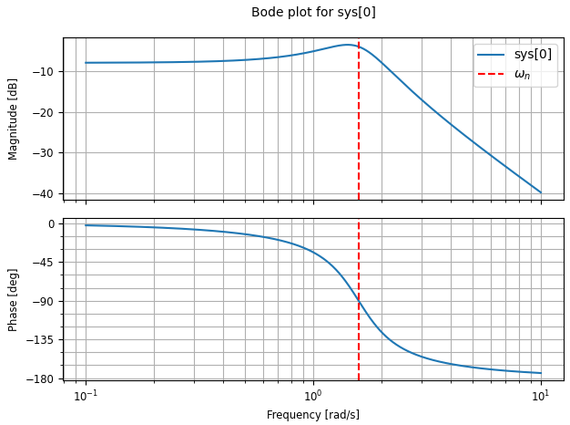
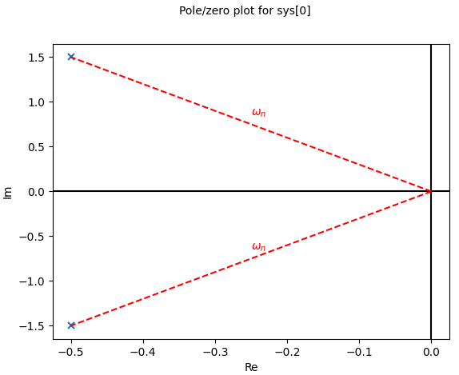

# Mass-Spring-Damper — Rosetta Stone

*Week 4 — GNC Curriculum*

---

## 1. Physical setup

A mass $m$ sits between a spring (stiffness $k$) and a damper (coefficient $b$). When you displace the mass by $x$ from its rest position, two forces push back.

The spring exerts $F_\text{spring} = -kx$. The negative sign is not a convention you memorise: it is just the geometry. If you push the mass to the right ($x > 0$), the spring pulls it to the left (force in the $-x$ direction). The force always opposes the displacement.

The damper exerts $F_\text{damper} = -b\dot{x}$. Same logic: the damper resists whatever direction the mass is currently moving. If the mass moves right ($\dot{x} > 0$), the damper pushes left.

Applying Newton's second law $F = ma$, with $a = \ddot{x}$:

$$m\ddot{x} = -kx - b\dot{x}$$

Rearranged into the standard form you will see in every textbook:

$$m\ddot{x} + b\dot{x} + kx = 0$$

This is the equation of motion. Three terms: inertia on the left, damping and restoring force on the right. Everything that follows is the story of what solutions this equation admits.

---

## 2. The solution ansatz

The standard move for a linear ODE with constant coefficients is to guess a solution of the form:

$$x(t) = e^{st}$$

where $s$ is a complex number to be determined. The reasoning behind the guess is simple: $e^{st}$ is the only function whose derivatives are proportional to itself, which means substituting it into a linear ODE collapses every term into the same function and leaves you with an algebraic equation in $s$ instead of a differential one.

Substituting $x = e^{st}$, $\dot{x} = se^{st}$, $\ddot{x} = s^2 e^{st}$:

$$ms^2 e^{st} + bs\,e^{st} + ke^{st} = 0$$

Dividing through by $e^{st} \neq 0$:

$$ms^2 + bs + k = 0$$

Dividing by $m$:

$$s^2 + \frac{b}{m}s + \frac{k}{m} = 0$$

This is the **characteristic equation**. Its roots are the values of $s$ for which $e^{st}$ is a solution. Since it is quadratic, there are two roots, and the general solution is a superposition of the two corresponding exponentials.

---

## 3. Roots and the discriminant

Applying the quadratic formula with discriminant $\Delta = \left(\frac{b}{m}\right)^2 - \frac{4k}{m}$:

$$s_{1,2} = \frac{-\frac{b}{m} \pm \sqrt{\Delta}}{2}$$

The sign of $\Delta$ defines three qualitatively different behaviours. If $\Delta < 0$, the square root produces an imaginary number, so $s_{1,2}$ are complex conjugates. Complex exponentials produce oscillations via Euler's formula ($e^{i\theta} = \cos\theta + i\sin\theta$), so the system oscillates. If $\Delta = 0$, there is a repeated real root and no oscillation. If $\Delta > 0$, two distinct real roots, also no oscillation but with two distinct decay rates. These three cases are underdamped, critically damped, and overdamped respectively, treated fully in Section 5.

---

## 4. Discovering natural frequency and damping ratio

Before writing down the solutions explicitly, it is worth rearranging the roots into a form that carries physical meaning. Right now the roots are expressed in terms of $b$, $m$, and $k$ independently. But the behaviour of the system is not governed by these three numbers individually: it is governed by certain combinations of them. Here is how those combinations emerge naturally.

**Step 1: identify what sets the oscillation frequency.** Suppose there is no damping at all ($b = 0$). The characteristic equation becomes $s^2 + k/m = 0$, giving $s = \pm i\sqrt{k/m}$. A purely imaginary root means purely sinusoidal oscillation at frequency $\sqrt{k/m}$. This is the frequency the system wants to oscillate at when nothing is fighting it. It depends only on the spring and the mass, which makes physical sense: a stiffer spring means faster oscillation, a heavier mass means slower. This motivates defining:

$$\omega_n = \sqrt{\frac{k}{m}}$$

This is the **natural frequency** of the system, in radians per second.

**Step 2: identify what sets the decay rate.** Look at the real part of the roots in the underdamped case. With $\Delta < 0$, the roots are $s_{1,2} = -\frac{b}{2m} \pm i(\ldots)$. The real part is $-b/(2m)$. This is the decay rate of the oscillation envelope: larger $b$ means faster decay, larger $m$ means slower decay. Notice that $k$ does not appear here at all. Stiffness has no effect on how fast the oscillations die out.

**Step 3: find the critical damping threshold.** Ask the question: what value of $b$ puts the system exactly at the boundary between oscillating and not oscillating? That is the $\Delta = 0$ condition: $\left(\frac{b}{m}\right)^2 = \frac{4k}{m}$, which gives $b_\text{crit} = 2\sqrt{km}$. This is the **critical damping coefficient**: the exact amount of damping needed to just barely kill the oscillations.

**Step 4: define a ratio.** A natural question follows: how much damping do I have, relative to this critical threshold? Define:

$$\zeta = \frac{b}{2\sqrt{km}} = \frac{b}{b_\text{crit}}$$

This is the **damping ratio**. When $\zeta < 1$, you have less damping than critical and the system oscillates. When $\zeta > 1$, you have more and it creeps back without oscillating. When $\zeta = 1$, you are exactly at the boundary.

**Step 5: rewrite the roots.** Now compute the product $\zeta \cdot \omega_n$:

$$\zeta \cdot \omega_n = \frac{b}{2\sqrt{km}} \cdot \sqrt{\frac{k}{m}} = \frac{b}{2m}$$

This is exactly the decay rate identified in Step 2. So the real part of the roots, $-b/(2m)$, is simply $-\zeta\omega_n$. The roots become:

$$s_{1,2} = -\zeta\omega_n \pm \omega_n\sqrt{\zeta^2 - 1}$$

In the underdamped case ($\zeta < 1$), the square root is imaginary, so define the **damped natural frequency**:

$$\omega_d = \omega_n\sqrt{1 - \zeta^2}$$

This is the actual oscillation frequency of the damped system, always slower than $\omega_n$ because damping bleeds energy away. The roots are then:

$$s_{1,2} = -\zeta\omega_n \pm i\,\omega_d$$

---

## 5. The three solution forms

The names of the three regimes are positional: they describe where your actual damping sits relative to the critical threshold $b_\text{crit} = 2\sqrt{km}$ derived in Section 4.

**Critical damping** is named first because it is the reference point. "Critical" means the same thing it does in "critical temperature" or "critical point": a precise boundary where behaviour changes qualitatively. At $\zeta = 1$ the system returns to equilibrium as fast as possible without overshooting. It is the knife-edge between oscillatory and non-oscillatory behaviour.

**Underdamped** means you have *less* damping than critical, hence "under" ($\zeta < 1$). With insufficient damping, the spring force dominates: the mass overshoots equilibrium, gets pulled back, overshoots again. The system oscillates because there is not enough friction to kill the motion in one pass. A car with worn-out shock absorbers bounces several times after a bump instead of settling immediately: that is an underdamped suspension.

**Overdamped** means you have *more* damping than critical, hence "over" ($\zeta > 1$). The damper is now so strong that it resists the spring's attempt to pull the mass back. The system does return to equilibrium, but sluggishly and without ever crossing zero. The same car filled with thick oil instead of proper damping fluid would barely move at all.

In practice, GNC systems are often tuned to $\zeta \approx 0.7$, slightly underdamped. A small overshoot is acceptable, and the response feels snappier than critical damping. You will make exactly this trade-off when tuning PID gains in Phase 2.

### Underdamped — $\zeta < 1$

The general solution is a superposition $x(t) = C_1 e^{s_1 t} + C_2 e^{s_2 t}$. Since $x(t)$ is a physical displacement it must be real, which forces $C_1$ and $C_2$ to be complex conjugates. Substituting the roots and factoring out the real part of the exponent:

$$x(t) = e^{-\zeta\omega_n t}\!\left(C_1 e^{i\omega_d t} + C_2 e^{-i\omega_d t}\right)$$

Applying Euler's formula $e^{i\theta} = \cos\theta + i\sin\theta$ to both terms and grouping real parts, the complex constants absorb into two real constants $A = C_1 + C_2$ and $B = i(C_1 - C_2)$:

$$\boxed{x(t) = e^{-\zeta\omega_n t}\!\left(A\cos(\omega_d t) + B\sin(\omega_d t)\right)}$$

The exponential $e^{-\zeta\omega_n t}$ is the decay envelope, set entirely by $b$ and $m$ through $\zeta\omega_n = b/(2m)$. The cosine and sine are the oscillation inside it, set by $k$ and $m$ through $\omega_d$. These two ingredients are independent of each other.

### Critically damped — $\zeta = 1$

When $\Delta = 0$ there is a repeated root $s = -\omega_n$. A repeated root in a second-order ODE requires a special solution form to produce two linearly independent solutions:

$$x(t) = (A + Bt)\,e^{-\omega_n t}$$

This is the fastest possible return to equilibrium with no overshoot.

### Overdamped — $\zeta > 1$

Two distinct negative real roots $s_1 < s_2 < 0$:

$$x(t) = A e^{s_1 t} + B e^{s_2 t}$$

The system decays without oscillating, but more slowly than critical damping. The slower root $s_2$ dominates at large $t$.

---

## 6. Solving for initial conditions

The constants $A$ and $B$ are fixed by the initial displacement $x(0)$ and initial velocity $\dot{x}(0)$.

For the underdamped case with $x(0) = x_0$ and $\dot{x}(0) = 0$ (displaced and released from rest): evaluating $x(t)$ at $t = 0$ gives $A = x_0$ directly, since $\cos(0) = 1$ and $\sin(0) = 0$.

To find $B$, differentiate $x(t)$ and evaluate at $t = 0$:

$$\dot{x}(0) = -\zeta\omega_n A + \omega_d B = 0 \implies B = \frac{\zeta\omega_n}{\omega_d}\,x_0$$

The full solution for a system released from $x_0$ at rest is:

$$x(t) = x_0\,e^{-\zeta\omega_n t}\!\left(\cos(\omega_d t) + \frac{\zeta\omega_n}{\omega_d}\sin(\omega_d t)\right)$$

---

# MSD ODE with Transfer Function

From the MSD EOM:
$$m\ddot{x} + kx + b\dot{x} =  F(t)$$

replacing the solution with $e^{st}$ we get:
$$(ms^2 + cs + k) X(s) = F(s)$$

which leads to the **tranfer function** $H(s) = \frac{X(s)}{F(s)}$:
$$H(s) = \frac{1}{ms^2 + cs + k}$$

### Pole locations

The poles are the roots of the denominator $ms^2 + bs + k = 0$, i.e. the values of $s$ for which $H(s)$ blows up. Applying the quadratic formula:

$$s_{1,2} = \frac{-b \pm \sqrt{b^2 - 4mk}}{2m}$$

Rewriting in terms of $\zeta$ and $\omega_n$:

**Underdamped** ($\zeta < 1$): complex conjugate pair, system oscillates.
$$s_{1,2} = -\zeta\omega_n \pm j\,\omega_n\sqrt{1 - \zeta^2}$$

**Critically damped** ($\zeta = 1$): repeated real root, fastest return without overshoot.
$$s_{1,2} = -\omega_n \quad \text{(repeated)}$$

**Overdamped** ($\zeta > 1$): two distinct negative real roots, no oscillation.
$$s_{1,2} = -\zeta\omega_n \pm \omega_n\sqrt{\zeta^2 - 1}$$

---

### Pole location cheat sheet

Every qualitative behaviour of the system is encoded in where the pole sits in the complex plane. Writing $s = \sigma + j\omega_d$:

| Property | What it controls | Formula |
|---|---|---|
| Real part $\sigma$ | Decay rate and stability | $\sigma = -\zeta\omega_n$ |
| Imaginary part $\omega_d$ | Oscillation frequency | $\omega_d = \omega_n\sqrt{1-\zeta^2}$ |
| Distance from origin | Natural frequency | $\lvert s \rvert = \omega_n$ |
| Angle from negative real axis | Damping ratio | $\cos\theta = \zeta$ |

Stability rule: if $\sigma < 0$ (left half-plane), the system is stable. If $\sigma > 0$ (right half-plane), the system is unstable. The MSD always has $\sigma < 0$ because $\zeta > 0$ and $\omega_n > 0$ by construction.

---
## 7. Stability

The real part of every root is $\sigma = -\zeta\omega_n$. Since $\zeta > 0$ and $\omega_n > 0$ for any physical spring-damper system, $\sigma$ is always negative, meaning $e^{\sigma t} \to 0$ as $t \to \infty$: the MSD always returns to equilibrium.

This leads to a general principle that governs every system in this curriculum. **The sign of the real part of a pole determines stability.** Negative real part: stable, response decays. Positive real part: unstable, response grows without bound. Zero real part: marginal. This principle applies identically to a PID-controlled gimbal, an LQR-stabilised pitch axis, or a Kalman filter's state propagation. The MSD is the simplest system where you can see it clearly.

---

## 8. What $k$ and $b$ each control (a common confusion)

Looking at the interactive widget, increasing $k$ can look as if it damps the system faster. It does not. The proof is in the decay rate $\zeta\omega_n = b/(2m)$: no $k$ appears anywhere. What $k$ controls is $\omega_d$, the oscillation frequency. Increasing $k$ speeds up the oscillations. At high enough $k$, the oscillations become so fast relative to the plot's time window that the curve looks smooth, creating the illusion of heavier damping. Zooming in to the first fraction of a second reveals the oscillations hiding there.

| Parameter | Controls | Formula |
|-----------|----------|---------|
| $b$ | Decay rate of envelope | $\sigma = -b/(2m)$ |
| $k$ | Frequency of oscillation | $\omega_d = \omega_n\sqrt{1-\zeta^2}$ |
| Both | Damping ratio | $\zeta = b / (2\sqrt{km})$ |

---

## 9. Why this matters for GNC

Every linear system in Phases 2 through 5 is the MSD wearing a different costume. A PID-controlled gimbal axis is a second-order system with poles at $s_{1,2}$, and tuning the gains is equivalent to placing those poles in the complex plane. An LQR-stabilised pitch axis has eigenvalues of the closed-loop matrix $A - BK$ that obey the same stability rule. A Kalman filter propagates state uncertainty through a matrix exponential that is the direct generalisation of $e^{st}$. The language built here, poles, decay rate, oscillation frequency, stability from the sign of the real part, is the language of everything that follows.

---

## 10. Bode plot interpretation

The Bode plot answers one question: if I drive this system with a pure sinusoid $F(t) = A\sin(\omega t)$, what comes out?

The answer is $x(t) = A\lvert H(j\omega)\rvert \sin(\omega t + \angle H(j\omega))$. The two subplots give you both factors simultaneously for every frequency $\omega$.

**Magnitude plot.** Evaluating $H$ on the imaginary axis $s = j\omega$:

$$H(j\omega) = \frac{1}{(k - m\omega^2) + jb\omega}$$

At low frequencies ($\omega \to 0$): the denominator approaches $k$, so $\lvert H \rvert \approx 1/k$, a constant. This is the flat region on the left. The system behaves like a static spring.

Near $\omega_n$: the real part of the denominator $(k - m\omega^2)$ shrinks toward zero, so the denominator is small and $\lvert H \rvert$ peaks. This is the resonance. A lightly damped system ($\zeta \ll 1$) produces a sharp, tall peak; a heavily damped system produces a broad, flat hump.

At high frequencies ($\omega \to \infty$): the $-m\omega^2$ term dominates, giving $\lvert H(j\omega)\rvert \sim 1/(m\omega^2)$. In decibels: $20\log_{10}(1/\omega^2) = -40\log_{10}(\omega)$, which is a slope of $-40$ dB per decade. Each pole contributes $-20$ dB/decade; two poles give $-40$ dB/decade.

**Phase plot.** The phase of $H(j\omega)$ is minus the phase of its denominator. Three key frequencies:

- $\omega \to 0$: denominator is $k > 0$, a positive real number. Phase of $H$ is $0°$.
- $\omega = \omega_n$: denominator is $jb\omega_n$, purely imaginary. Phase of $H$ is $-90°$.
- $\omega \to \infty$: denominator is dominated by $-m\omega^2 < 0$, a negative real number. Phase of $H$ is $-180°$.

The $-90°$ crossing at $\omega_n$ is not a coincidence: it is exactly where $k - m\omega^2 = 0$, leaving only the imaginary damping term. This makes $\omega_n$ directly readable off the phase plot without needing to find the magnitude peak.

### Illustration 1: annotated Bode plot

---

### Illustration 2: pole-zero plot

---

## 11. What the Bode plot is for

On its own, the Bode plot of an open-loop plant is descriptive, not prescriptive. Its engineering value appears when you close a feedback loop. The open-loop transfer function of the combined controller-plus-plant is $L(s) = C(s) \cdot P(s)$. The Bode plot of $L(s)$ gives two numbers directly:

- **Phase margin**: how many additional degrees of phase lag the loop can tolerate before going unstable. Read at the frequency where $\lvert L(j\omega) \rvert = 1$ (0 dB crossover). A healthy design has $\geq 45°$.
- **Gain margin**: how much additional gain the loop can accept before going unstable. Read at the frequency where $\angle L(j\omega) = -180°$. A healthy design has $\geq 6$ dB.

For the TVC rig: the plant has an open-loop unstable pole in the right half-plane (the inverted pendulum instability). Any controller must provide enough gain at that pole's frequency to stabilise the loop, while maintaining sufficient phase margin at the crossover frequency. The Bode plot is the tool that tells you whether your design achieves both simultaneously.